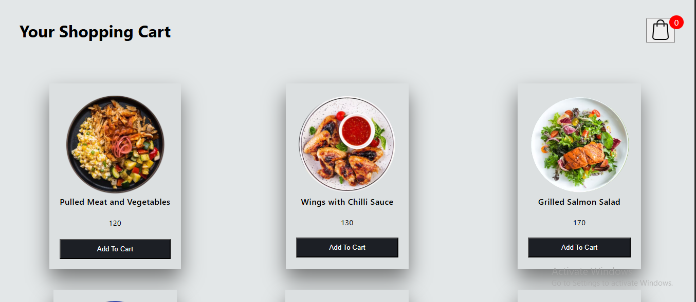
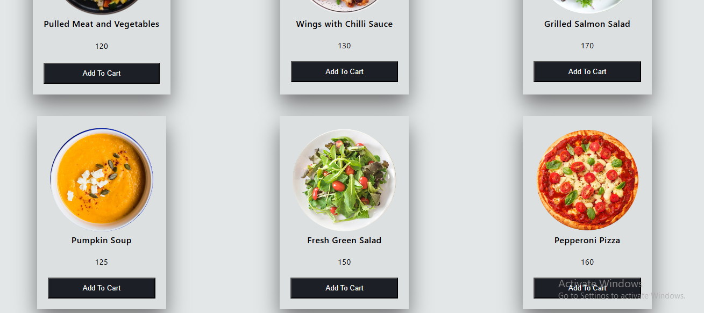
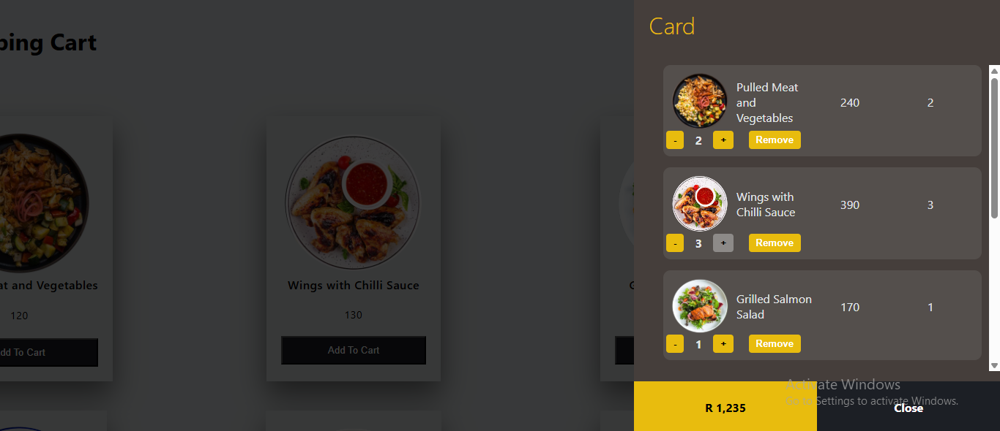

Shopping Cart – Birsh
A responsive and accessible shopping cart built with HTML, CSS, and JavaScript. Users can browse products, add items to a cart, adjust quantities, and experience a fully interactive interface across devices.

Features

1. Product Listing and Cart System
   Displays product items with images, names, and prices.

Each item includes an "Add to Cart" button.

A shopping cart icon displays total items added.

A side cart (.card) opens on click and slides in from the right.

2. Quantity Control & Price Calculation
   Adjust item quantities with + and – buttons.

Total price updates in real-time.

Option to remove items individually from the cart.

Price updates dynamically based on quantity.

3. Cart UX Enhancements
   Empty cart warning with message and "Continue Shopping" button.

Cart scrollable when content overflows.

Prevents scrolling of the main page when cart is open.

Cart closes when clicking on the overlay area (body.active:before).

Smooth cart opening/closing transitions.

4. Responsive Design
   Media queries for tablet and mobile breakpoints.

Adjusts grid layout from 3 columns to 1 for small screens.

Cart and product layout scales properly on all screen sizes.

.listCard and other UI elements resize accordingly.

5. Visual and Feedback Enhancements
   Fixed width for product images for consistent display.

Visual confirmation message (Item added to cart) upon product addition.

Improved spacing and layout in .listCard to avoid cramped content.

6. Accessibility Improvements
   All images include descriptive alt text.

All interactive elements include aria-labels.

Added tabindex and focus styles for keyboard navigation.

Focus trap activated when cart is open: Tab key cycles within cart only.

Focus trap deactivated when cart is closed: Tab skips cart.

Screenshots
Main Screen (Product List)
Place your screenshot here of the default landing screen with product list.

Shopping Cart (Cart Opened)
Place your screenshot here of the cart opened showing added items continued.

Shopping Cart (Cart Opened)
Place your screenshot here of the cart opened showing added items.

Technologies Used
HTML5

CSS3

Vanilla JavaScript (ES6+)

Accessibility Checklist
Alt text on all images

ARIA labels on interactive elements

Tab navigation for all actionable UI

Focus trapping within modal/cart

Visual focus indicators

How to Run
Clone the repository.

Make sure the img/ folder contains all product images (1.PNG, 2.PNG, etc.).

Open index.html in your browser.
